## Introduction
In this project, we will be implementing Variational Autoencoder (VAE) and its variations, namely Beta Variational Autoencoder (Beta-VAE) and Conditional Variational Autoencoder (CVAE). After completing the implementations, we will investigate the effect of the beta parameter on disentanglement and generation quality, with the aim of gaining insights into the relationship between these factors.

## Requirement
First, you need to install the required dependencies. You can do this by running the following command in your terminal:

```
make requirements
```

This command will automatically install all the necessary libraries and dependencies needed to run the code in this repository. Make sure you have the required libraries installed before proceeding with the next steps.


## Models
As mentioned earlier, we have implemented three different types of Variational Autoencoders (VAEs): Vanilla VAE, Beta VAE, and Conditional VAE (CVAE).

### 1.Vanilla VAE:
The Vanilla VAE consists of an encoder and a decoder. The encoder provides a representation for us, which usually follows a Normal distribution. The loss function of the VAE consists of two terms: the reconstruction term and the KL divergence term. The VAE aims to minimize the sum of these two terms with a coefficient of 1 (equally weighted).


$$\mathcal{L}(\theta, \phi ; \mathbf{x}, \mathbf{z})=\mathbb{E}_{q_\phi(\mathbf{z} \mid \mathbf{x})}\left[\log p_\theta(\mathbf{x} \mid \mathbf{z})\right]-D_{K L}\left(q_\phi(\mathbf{z} \mid \mathbf{x}) \| p(\mathbf{z})\right)$$

<table style="text-align: center margin-left: auto; margin-right: auto; text-align: center" border=0 align=center>
	<thead>
	</thead>
    <tbody style="text-align: center margin-left: auto; margin-right: auto; text-align: center" border=0 align=center>
        <tr>
            <td>
                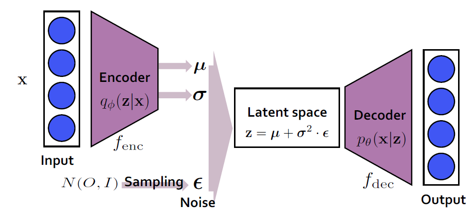
            </td>
        </tr>
        <tr>
        	<td colspan=1>
        		VAE architecture
        	</td>
        </tr>
    </tbody>
</table>

### 2.Beta-VAE:
The Beta-VAE is similar to the Vanilla VAE, but the terms in the loss function are combined with each other using the coefficient beta. Beta has a value greater than one. By considering the value of beta, the coefficient of the second term (KL divergence), we can control the quality of generated images. Smaller values of beta result in higher image quality, while larger values of beta encourage more disentangled representations in the latent space.

$$\mathcal{L}(\theta, \phi ; \mathbf{x}, \mathbf{z})=\mathbb{E}_{q_\phi(\mathbf{z} \mid \mathbf{x})}\left[\log p_\theta(\mathbf{x} \mid \mathbf{z})\right]-\beta \times D_{K L}\left(q_\phi(\mathbf{z} \mid \mathbf{x}) \| p(\mathbf{z})\right)$$

### 3.CVAE:
In Conditional VAE (CVAE), we incorporate labels as additional inputs alongside the images in the encoder and decoder. In other words, the inputs of the encoder in CVAE are images and labels, and the inputs of the decoder are latent representations and labels. After training the model, we can generate or reconstruct images of a specific class by providing the corresponding label.

<table style="text-align: center margin-left: auto; margin-right: auto; text-align: center" border=0 align=center>
	<thead>
	</thead>
    <tbody style="text-align: center margin-left: auto; margin-right: auto; text-align: center" border=0 align=center>
        <tr>
            <td>
                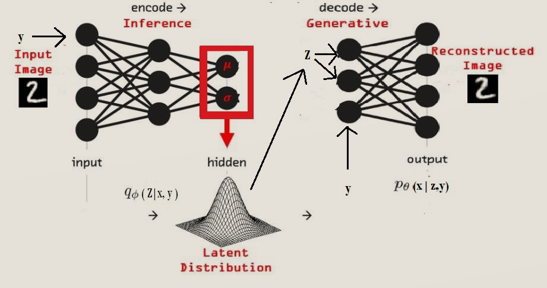
            </td>
        </tr>
        <tr>
        	<td colspan=1>
        		Conditional-VAE architecture
        	</td>
        </tr>
    </tbody>
</table>

## Dataset: MNIST

The MNIST dataset is a widely-used benchmark dataset in the field of machine learning and computer vision. It consists of a collection of grayscale images of handwritten digits, ranging from 0 to 9. The dataset is composed of 60,000 training images and 10,000 test images, each of which is 28 pixels by 28 pixels in size. The images are accompanied by corresponding labels indicating the correct digit for each image. The MNIST dataset is commonly used for tasks such as image classification, where the goal is to train a machine learning model to accurately predict the digit represented in a given image. 

In the models mentioned earlier, the encoder takes the flattened image as input, which is essentially a vector with a shape of 784 for each image. In other words, it is a 784-dimensional vector representation. For the CVAE model, we concatenate the label to this vector, resulting in an input shape of 785.

<br>
<table style="text-align: center margin-left: auto; margin-right: auto; text-align: center" border=0 align=center>
	<thead>
	</thead>
    <tbody style="text-align: center margin-left: auto; margin-right: auto; text-align: center" border=0 align=center>
        <tr>
            <td>
                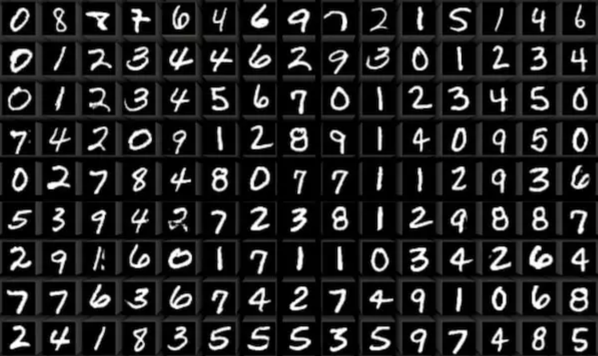
            </td>
        </tr>
        <tr>
        	<td colspan=3>
        		Examples of MNIST images
        	</td>
        </tr>
    </tbody>
</table>

## Training

For Instance, to train beta-vae,beta=2, with 10 epochs, you can use the following command.
```
python train.py -m bvae -e 10 -b 2
```
If you want to customize other options, you can run the following command and choose the arguments you want to modify.
```
python train.py --help
```

## Results
Firstly, we aim to analyze the results of the loss function from different models. As we anticipated, increasing beta would prioritize the reduction of the KL-divergence term, resulting in a more disentangled representation space within the model. Conversely, decreasing beta would emphasize the reduction of the reconstruction term, leading to the generation of higher quality samples by our model.

<table style="margin-left: auto; margin-right: auto;" border=0 align=center>
    <thead>
        <tr>
            <th style="text-align: center;">Model</th>
            <th style="text-align: center;">Generated Images</th>
        </tr>
    </thead>
    <tbody style="text-align: center; margin-left: auto; margin-right: auto;">
        <tr>
            <td style="text-align: center;">
                <strong>Reconstruction term</strong>
            </td>
            <td style="text-align: center;">
                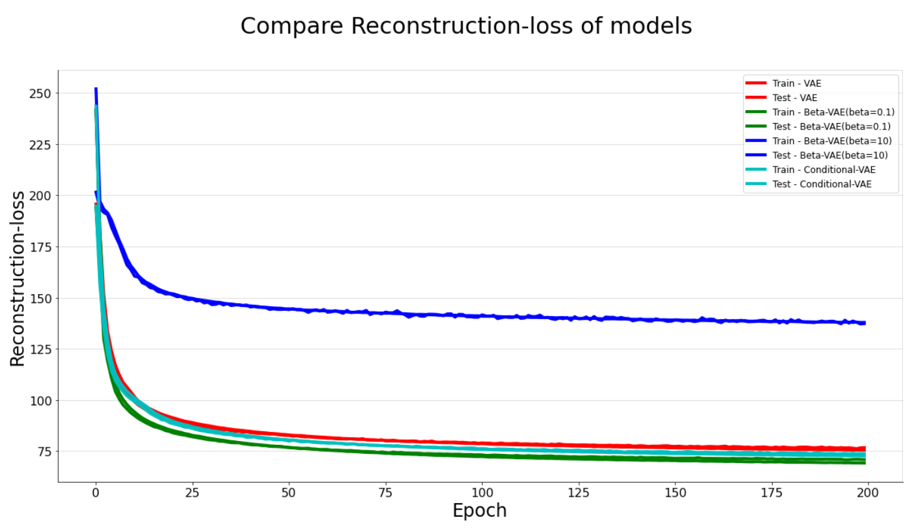
            </td>
        </tr>
        <tr>
            <td style="text-align: center;">
                <strong>KL divergence term</strong>
            </td>
            <td style="text-align: center;">
                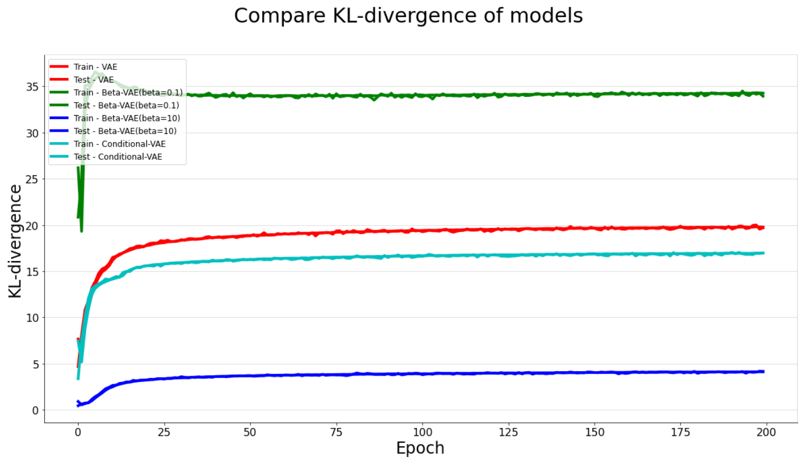
            </td>
        </tr>
        <tr>
            <td style="text-align: center;">
                <strong>NELBO</strong>
            </td>
            <td style="text-align: center;">
                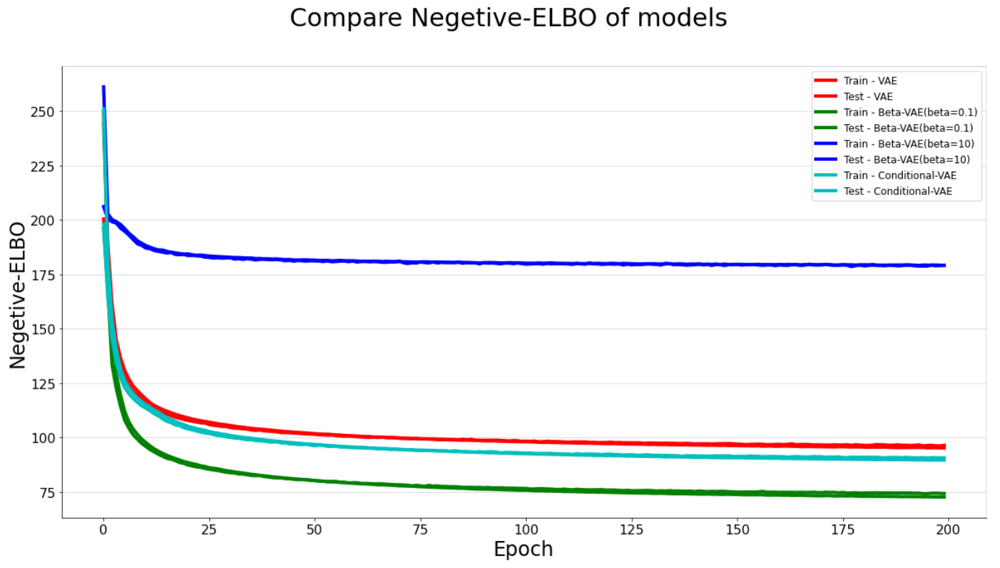
            </td>
        </tr>
    </tbody>
    <tfoot>
        <tr>
            <td colspan="2" style="text-align: center; font-style: italic;">Loss comparison</td>
        </tr>
    </tfoot>
</table>


The table below displays the results of training the models. As we can observe, increasing the value of beta leads to a decrease in the quality of the images. On the other hand, decreasing the value of beta results in an increase in image quality, but also an increase in the disentanglement property. These findings are in line with our expectations.


<table style="margin-left: auto; margin-right: auto;" border=0 align=center>
    <thead>
        <tr>
            <th style="text-align: center;">Model</th>
            <th style="text-align: center;">Reconstructed Images</th>
            <th style="text-align: center;">Generated Images</th>
        </tr>
    </thead>
    <tbody style="text-align: center; margin-left: auto; margin-right: auto;">
        <tr>
            <td style="text-align: center;">
                <strong>&beta;VAE(&beta;=0.1)</strong>
            </td>
            <td style="text-align: center;">
                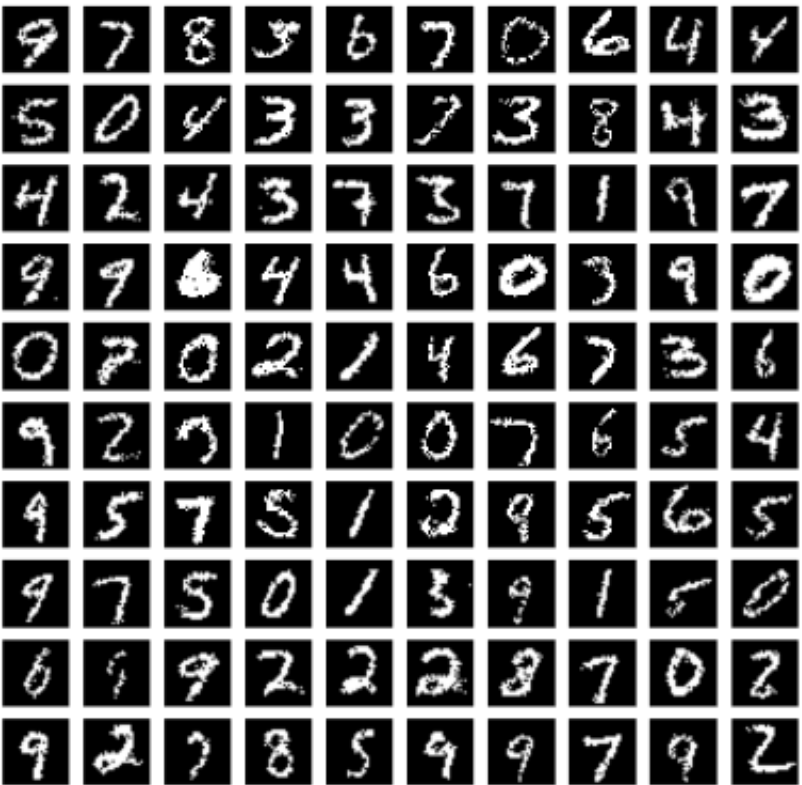
            </td>
            <td style="text-align: center;">
                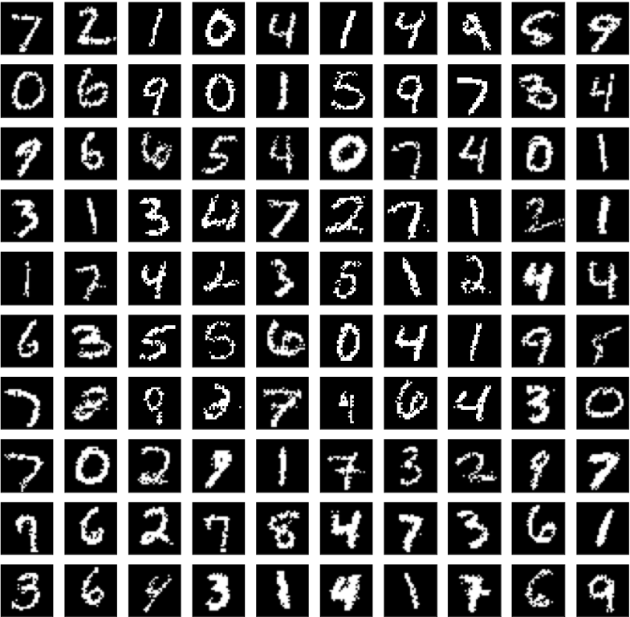
            </td>
        </tr>
        <tr>
            <td style="text-align: center;">
                <strong>VAE(&beta;=1)</strong>
            </td>
            <td style="text-align: center;">
                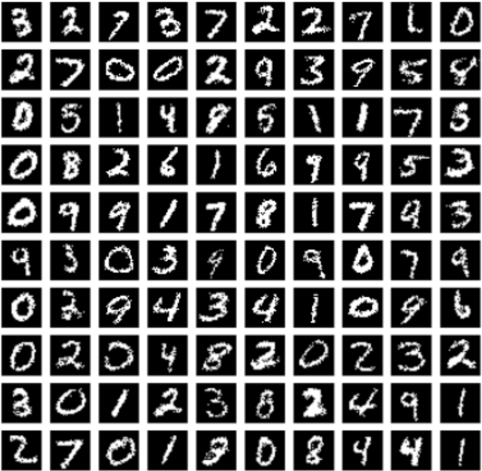
            </td>
            <td style="text-align: center;">
                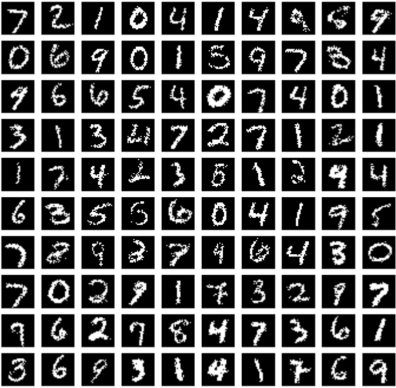
            </td>
        </tr>
        <tr>
            <td style="text-align: center;">
                <strong>&beta;VAE(&beta;=10)</strong>
            </td>
            <td style="text-align: center;">
                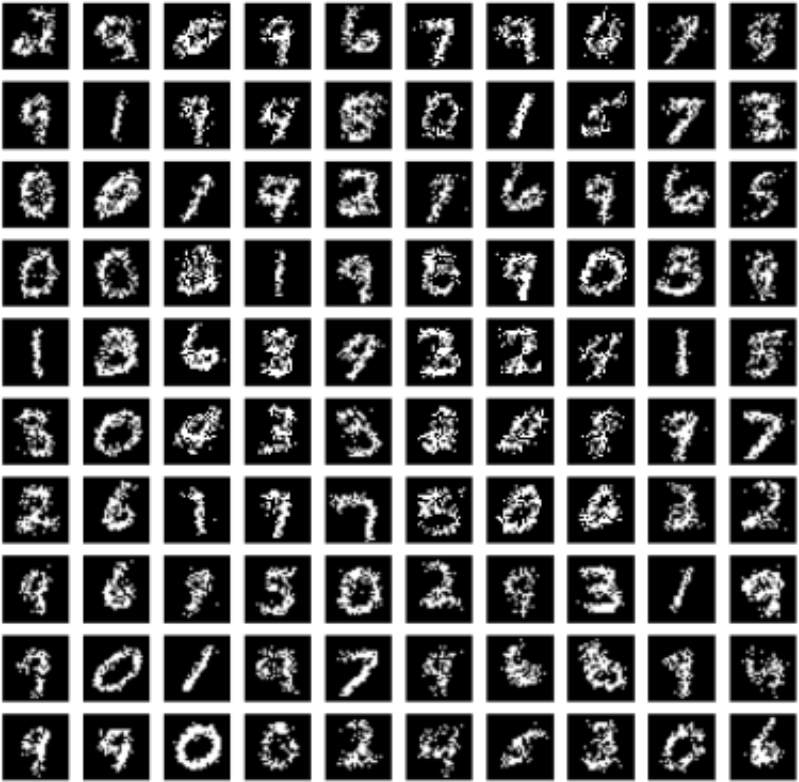
            </td>
            <td style="text-align: center;">
                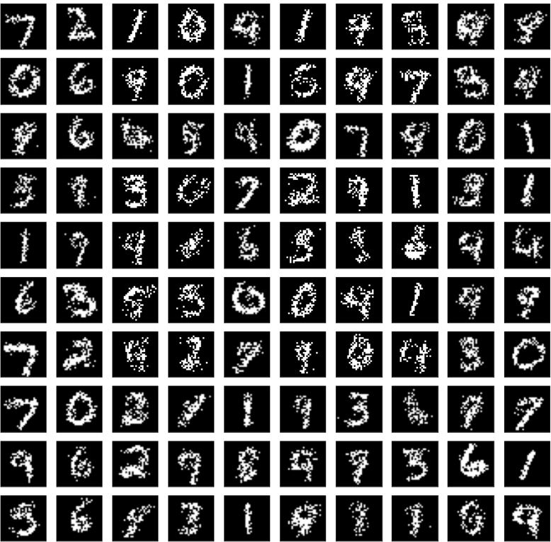
            </td>
        </tr>
    </tbody>
    <tfoot>
        <tr>
            <td colspan="3" style="text-align: center; font-style: italic;">Reconstructed and generated samples with varying values of &beta;</td>
        </tr>
    </tfoot>
</table>

<br/>
For further investigation of the disentanglement property, we present the results below. We assumed that the dimension of our latent space is 10. In our experiment, we kept the latent code values unchanged for all dimensions except the 6th dimension, which we traversed across the latent space. The results are organized in rows and columns, ranging from low to high values in the 6th dimension. As observed from the results below, increasing the value of beta leads to a more disentangled latent space. For example, with beta=1, the traversal starts from 3 and ends at 8, while with beta=0.1, it starts from 9 and ends at 7. However, with beta=10, the traversal starts and ends at 0, indicating that the latent space is more disentangled compared to the other values of beta, as we expected.
<br/><br/>
<table style="margin-left: auto; margin-right: auto;" border=0 align=center>
    <thead>
        <tr>
            <th style="text-align: center;">Model</th>
            <th style="text-align: center;">Generated Images</th>
        </tr>
    </thead>
    <tbody style="text-align: center; margin-left: auto; margin-right: auto;">
        <tr>
            <td style="text-align: center;">
                <strong>&beta;VAE(&beta;=0.1)</strong>
            </td>
            <td style="text-align: center;">
                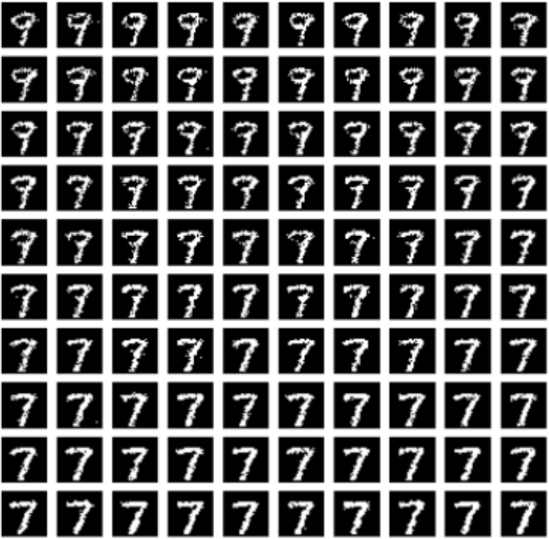
            </td>
        </tr>
        <tr>
            <td style="text-align: center;">
                <strong>VAE(&beta;=1)</strong>
            </td>
            <td style="text-align: center;">
                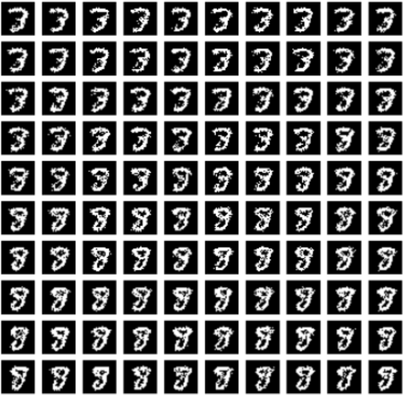
            </td>
        </tr>
        <tr>
            <td style="text-align: center;">
                <strong>&beta;VAE(&beta;=10)</strong>
            </td>
            <td style="text-align: center;">
                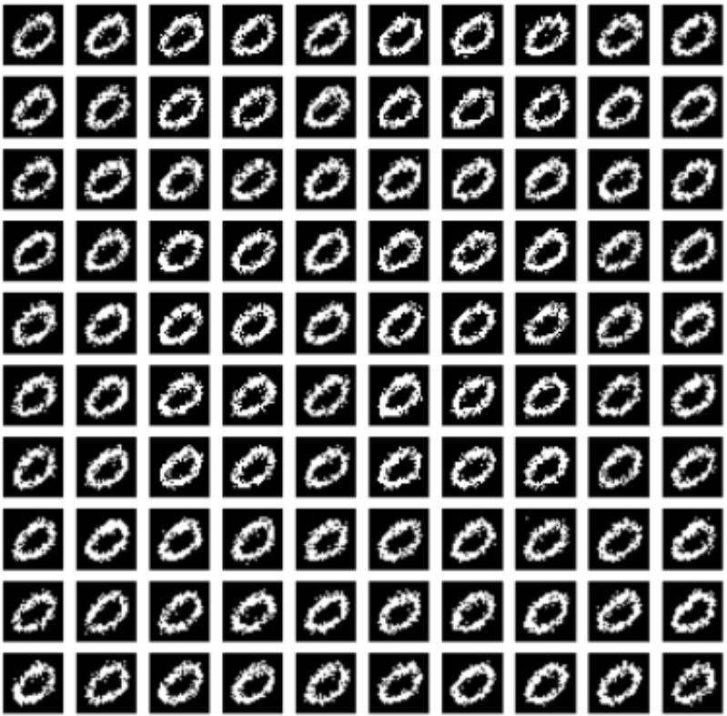
            </td>
        </tr>
    </tbody>
    <tfoot>
        <tr>
            <td colspan="2" style="text-align: center; font-style: italic;">Dimension 6 held constant while the others vary</td>
        </tr>
    </tfoot>
</table>

<br/>
Finally, we have some results of the samples generated by the Conditional Variational Autoencoder.
<br/><br/>
<table style="text-align: center margin-left: auto; margin-right: auto; text-align: center" border=0 align=center>
	<thead>
	</thead>
    <tbody style="text-align: center margin-left: auto; margin-right: auto; text-align: center" border=0 align=center>
        <tr>
            <td>
                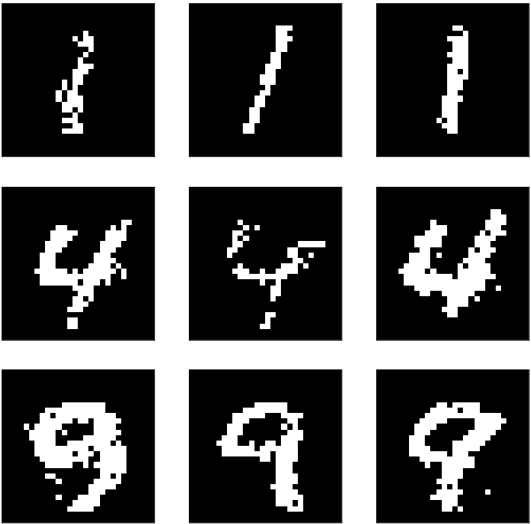
            </td>
        </tr>
        <tr>
        	<td colspan=3>
        		Generated samples of CVAE of classes 1,4,9
        	</td>
        </tr>
    </tbody>
</table>

## Conclusion

We can draw the conclusion that as we increase the beta coefficient, the disentanglement property becomes more evident, but the generation quality is lower. Conversely, if we decrease beta, the generation quality will be higher, but the disentanglement property will be less apparent

## References
* [Persian report]([./reports/](https://drive.google.com/file/d/1CDhxxCiY2BeO4BAzyRKGVFX4B8KEmrgi/view?usp=share_link)) 

